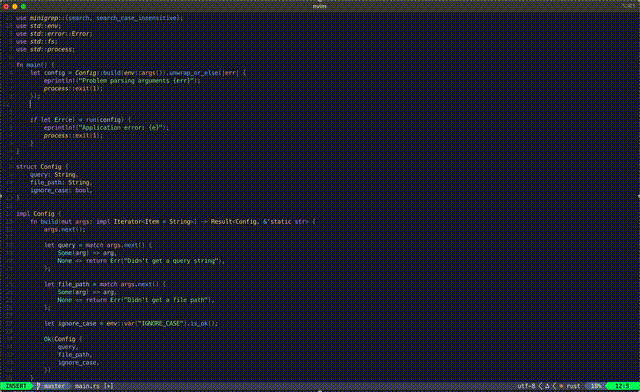
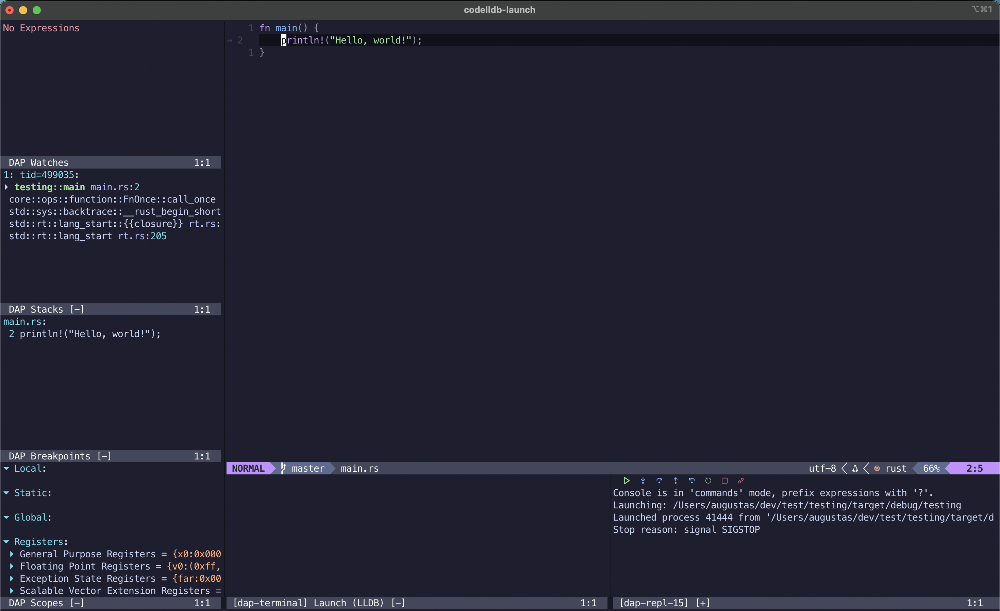
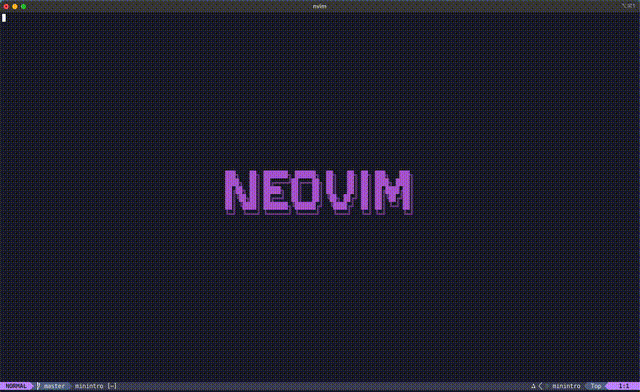

# NVIM

My custom NVim config. Primarily focused for **rust** and **lua**. Includes modern IDE capabilities.

## 🌟 Showcase

- **Code Editing:** Clean layout with integrated LSP diagnostics and completion.  


- **Debugging:** Variable inspection and breakpoints using CodeLLDB and nvim-dap.  


- **Fuzzy Finding:** Rapid file and text searching using Telescope.


## ⚙️ Requirements

To run this configuration, ensure you have the following tools installed:

| Tool | Purpose |
|------|---------|
| **Neovim** | Version `v0.9.0+` |
| **Git** | For plugin management |
| **A Nerd Font** | Required for icons |
| **A C Compiler** | Required for certain plugin compilations |
| **ripgrep (rg)** | Fast project-wide text search (Telescope’s `live_grep`) |
| **fd** | Fast file searching (Telescope’s `find_files`) |

## 🧩 Installation & Setup

Clone the repository:

```bash
git clone https://github.com/Serious-Fin/nvim ~/.config
```

Launch Neovim:

```bash
nvim
```

lazy.nvim will automatically bootstrap and install all configured plugins.

## 🔧 Mason Installed Tools
The following Language Servers, Formatters, and Debug Adapters are managed and installed via mason.nvim for integrated functionality:

| Tool Category | Package Name | Language |
|------|----------|---|
| LSP | rust-analyzer | Rust |
| LSP | lua-language-server | Lua |
| DAP | codelldb | Rust |
| Formatter | stylua | Lua |

## 🧠 Language Support
| Language | Configured Features |
|-----|-----|
| Rust | Formatting, Code Suggestions, Debugging |
| Lua | Formatting, Code Suggestions |
